# Detailed Design - Sequence Diagrams

This document contains the 16 Mermaid sequence diagrams prepared for the HealthMate report.

## 1. Register Account

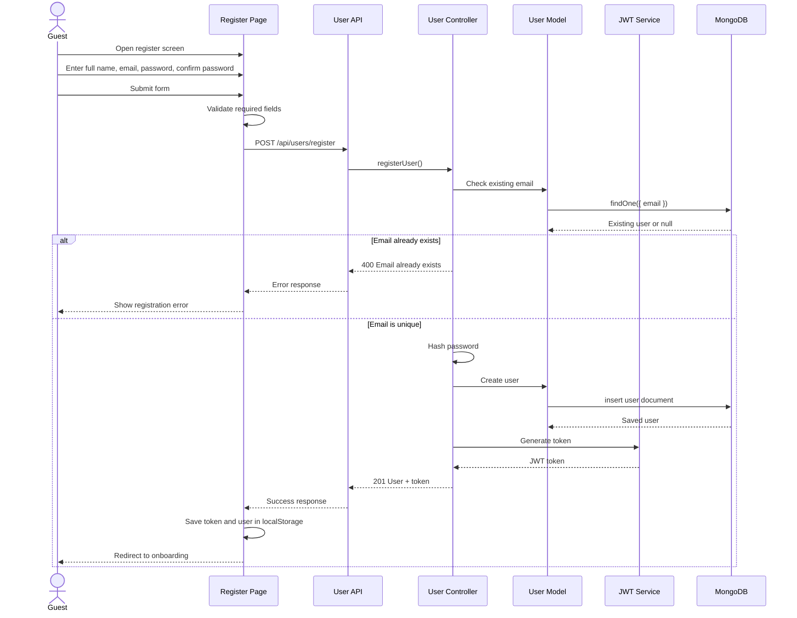
```mermaid
sequenceDiagram
    actor Guest
    participant RegisterPage as Register Page
    participant UserAPI as User API
    participant UserController as User Controller
    participant UserModel as User Model
    participant JWT as JWT Service
    participant DB as MongoDB

    Guest->>RegisterPage: Open register screen
    Guest->>RegisterPage: Enter full name, email, password, confirm password
    Guest->>RegisterPage: Submit form
    RegisterPage->>RegisterPage: Validate required fields
    RegisterPage->>UserAPI: POST /api/users/register
    UserAPI->>UserController: registerUser()
    UserController->>UserModel: Check existing email
    UserModel->>DB: findOne({ email })
    DB-->>UserModel: Existing user or null
    alt Email already exists
        UserController-->>UserAPI: 400 Email already exists
        UserAPI-->>RegisterPage: Error response
        RegisterPage-->>Guest: Show registration error
    else Email is unique
        UserController->>UserController: Hash password
        UserController->>UserModel: Create user
        UserModel->>DB: insert user document
        DB-->>UserModel: Saved user
        UserController->>JWT: Generate token
        JWT-->>UserController: JWT token
        UserController-->>UserAPI: 201 User + token
        UserAPI-->>RegisterPage: Success response
        RegisterPage->>RegisterPage: Save token and user in localStorage
        RegisterPage-->>Guest: Redirect to onboarding
    end
```

## 2. Login

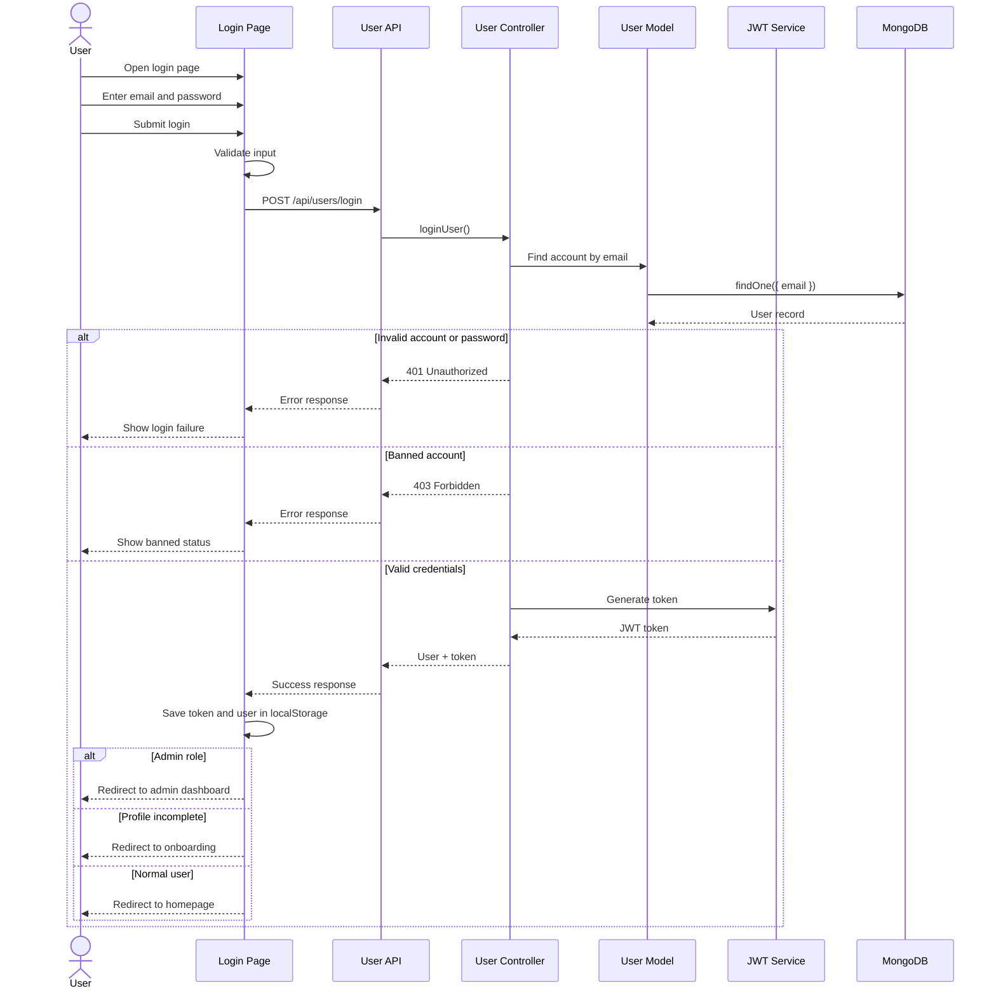
```mermaid
sequenceDiagram
    actor User
    participant LoginPage as Login Page
    participant UserAPI as User API
    participant UserController as User Controller
    participant UserModel as User Model
    participant JWT as JWT Service
    participant DB as MongoDB

    User->>LoginPage: Open login page
    User->>LoginPage: Enter email and password
    User->>LoginPage: Submit login
    LoginPage->>LoginPage: Validate input
    LoginPage->>UserAPI: POST /api/users/login
    UserAPI->>UserController: loginUser()
    UserController->>UserModel: Find account by email
    UserModel->>DB: findOne({ email })
    DB-->>UserModel: User record
    alt Invalid account or password
        UserController-->>UserAPI: 401 Unauthorized
        UserAPI-->>LoginPage: Error response
        LoginPage-->>User: Show login failure
    else Banned account
        UserController-->>UserAPI: 403 Forbidden
        UserAPI-->>LoginPage: Error response
        LoginPage-->>User: Show banned status
    else Valid credentials
        UserController->>JWT: Generate token
        JWT-->>UserController: JWT token
        UserController-->>UserAPI: User + token
        UserAPI-->>LoginPage: Success response
        LoginPage->>LoginPage: Save token and user in localStorage
        alt Admin role
            LoginPage-->>User: Redirect to admin dashboard
        else Profile incomplete
            LoginPage-->>User: Redirect to onboarding
        else Normal user
            LoginPage-->>User: Redirect to homepage
        end
    end
```

## 3. Google Login

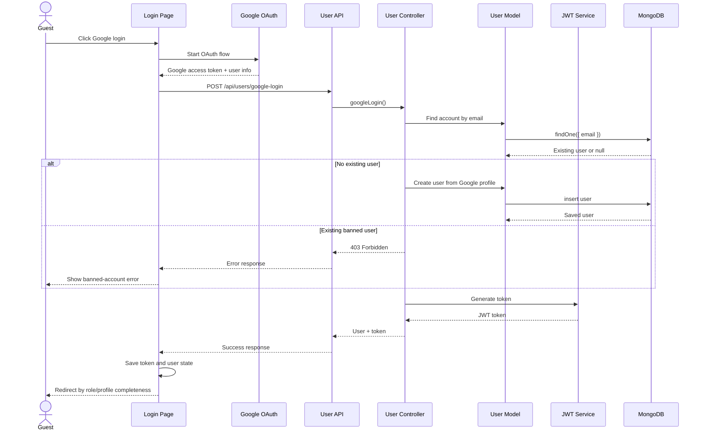
```mermaid
sequenceDiagram
    actor Guest
    participant LoginPage as Login Page
    participant GoogleOAuth as Google OAuth
    participant UserAPI as User API
    participant UserController as User Controller
    participant UserModel as User Model
    participant JWT as JWT Service
    participant DB as MongoDB

    Guest->>LoginPage: Click Google login
    LoginPage->>GoogleOAuth: Start OAuth flow
    GoogleOAuth-->>LoginPage: Google access token + user info
    LoginPage->>UserAPI: POST /api/users/google-login
    UserAPI->>UserController: googleLogin()
    UserController->>UserModel: Find account by email
    UserModel->>DB: findOne({ email })
    DB-->>UserModel: Existing user or null
    alt No existing user
        UserController->>UserModel: Create user from Google profile
        UserModel->>DB: insert user
        DB-->>UserModel: Saved user
    else Existing banned user
        UserController-->>UserAPI: 403 Forbidden
        UserAPI-->>LoginPage: Error response
        LoginPage-->>Guest: Show banned-account error
    end
    UserController->>JWT: Generate token
    JWT-->>UserController: JWT token
    UserController-->>UserAPI: User + token
    UserAPI-->>LoginPage: Success response
    LoginPage->>LoginPage: Save token and user state
    LoginPage-->>Guest: Redirect by role/profile completeness
```

## 4. Complete Onboarding / Update Profile

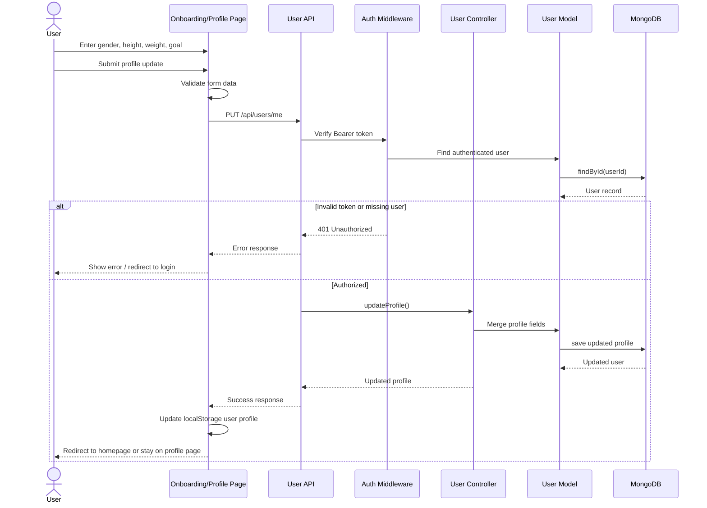
```mermaid
sequenceDiagram
    actor User
    participant OnboardingPage as Onboarding/Profile Page
    participant UserAPI as User API
    participant AuthMW as Auth Middleware
    participant UserController as User Controller
    participant UserModel as User Model
    participant DB as MongoDB

    User->>OnboardingPage: Enter gender, height, weight, goal
    User->>OnboardingPage: Submit profile update
    OnboardingPage->>OnboardingPage: Validate form data
    OnboardingPage->>UserAPI: PUT /api/users/me
    UserAPI->>AuthMW: Verify Bearer token
    AuthMW->>UserModel: Find authenticated user
    UserModel->>DB: findById(userId)
    DB-->>UserModel: User record
    alt Invalid token or missing user
        AuthMW-->>UserAPI: 401 Unauthorized
        UserAPI-->>OnboardingPage: Error response
        OnboardingPage-->>User: Show error / redirect to login
    else Authorized
        UserAPI->>UserController: updateProfile()
        UserController->>UserModel: Merge profile fields
        UserModel->>DB: save updated profile
        DB-->>UserModel: Updated user
        UserController-->>UserAPI: Updated profile
        UserAPI-->>OnboardingPage: Success response
        OnboardingPage->>OnboardingPage: Update localStorage user profile
        OnboardingPage-->>User: Redirect to homepage or stay on profile page
    end
```

## 5. Generate AI Fitness Roadmap

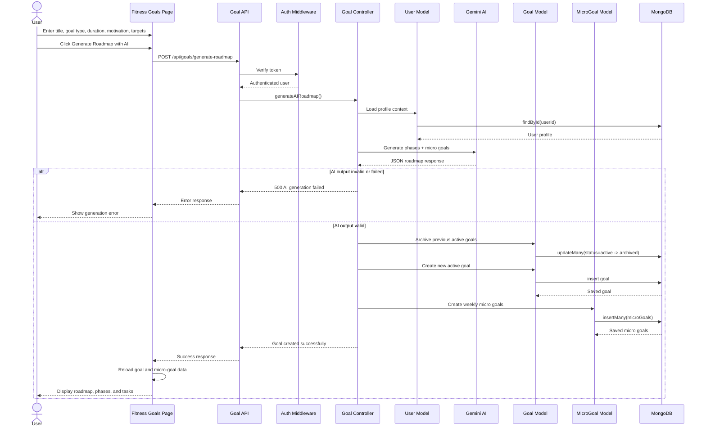
```mermaid
sequenceDiagram
    actor User
    participant FitnessGoals as Fitness Goals Page
    participant GoalAPI as Goal API
    participant AuthMW as Auth Middleware
    participant GoalController as Goal Controller
    participant UserModel as User Model
    participant Gemini as Gemini AI
    participant GoalModel as Goal Model
    participant MicroGoalModel as MicroGoal Model
    participant DB as MongoDB

    User->>FitnessGoals: Enter title, goal type, duration, motivation, targets
    User->>FitnessGoals: Click Generate Roadmap with AI
    FitnessGoals->>GoalAPI: POST /api/goals/generate-roadmap
    GoalAPI->>AuthMW: Verify token
    AuthMW-->>GoalAPI: Authenticated user
    GoalAPI->>GoalController: generateAIRoadmap()
    GoalController->>UserModel: Load profile context
    UserModel->>DB: findById(userId)
    DB-->>UserModel: User profile
    GoalController->>Gemini: Generate phases + micro goals
    Gemini-->>GoalController: JSON roadmap response
    alt AI output invalid or failed
        GoalController-->>GoalAPI: 500 AI generation failed
        GoalAPI-->>FitnessGoals: Error response
        FitnessGoals-->>User: Show generation error
    else AI output valid
        GoalController->>GoalModel: Archive previous active goals
        GoalModel->>DB: updateMany(status=active -> archived)
        GoalController->>GoalModel: Create new active goal
        GoalModel->>DB: insert goal
        DB-->>GoalModel: Saved goal
        GoalController->>MicroGoalModel: Create weekly micro goals
        MicroGoalModel->>DB: insertMany(microGoals)
        DB-->>MicroGoalModel: Saved micro goals
        GoalController-->>GoalAPI: Goal created successfully
        GoalAPI-->>FitnessGoals: Success response
        FitnessGoals->>FitnessGoals: Reload goal and micro-goal data
        FitnessGoals-->>User: Display roadmap, phases, and tasks
    end
```

## 6. Update Micro Goal Status

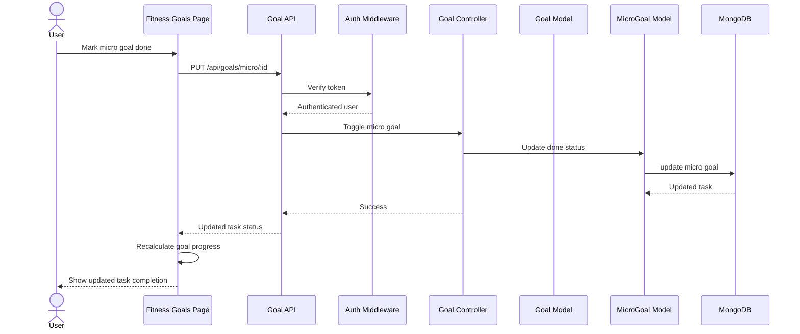
```mermaid
sequenceDiagram
    actor User
    participant FitnessGoals as Fitness Goals Page
    participant GoalAPI as Goal API
    participant AuthMW as Auth Middleware
    participant GoalController as Goal Controller
    participant GoalModel as Goal Model
    participant MicroGoalModel as MicroGoal Model
    participant DB as MongoDB

    User->>FitnessGoals: Mark micro goal done
    FitnessGoals->>GoalAPI: PUT /api/goals/micro/:id
    GoalAPI->>AuthMW: Verify token
    AuthMW-->>GoalAPI: Authenticated user
    GoalAPI->>GoalController: Toggle micro goal
    GoalController->>MicroGoalModel: Update done status
    MicroGoalModel->>DB: update micro goal
    DB-->>MicroGoalModel: Updated task
    GoalController-->>GoalAPI: Success
    GoalAPI-->>FitnessGoals: Updated task status
    FitnessGoals->>FitnessGoals: Recalculate goal progress
    FitnessGoals-->>User: Show updated task completion
```

## 7. Submit Weekly Check-in

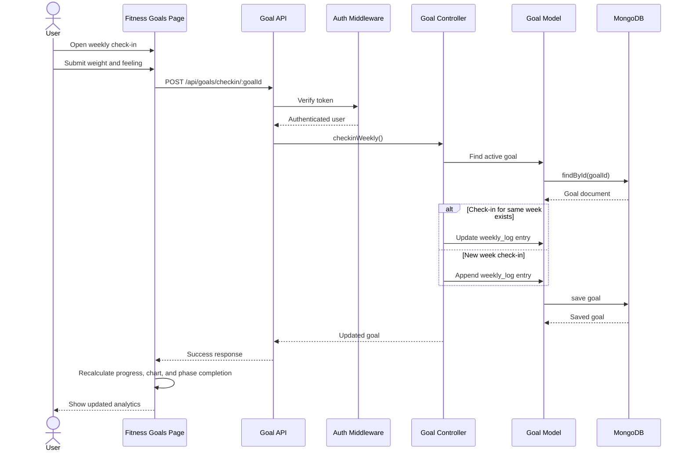
```mermaid
sequenceDiagram
    actor User
    participant FitnessGoals as Fitness Goals Page
    participant GoalAPI as Goal API
    participant AuthMW as Auth Middleware
    participant GoalController as Goal Controller
    participant GoalModel as Goal Model
    participant DB as MongoDB

    User->>FitnessGoals: Open weekly check-in
    User->>FitnessGoals: Submit weight and feeling
    FitnessGoals->>GoalAPI: POST /api/goals/checkin/:goalId
    GoalAPI->>AuthMW: Verify token
    AuthMW-->>GoalAPI: Authenticated user
    GoalAPI->>GoalController: checkinWeekly()
    GoalController->>GoalModel: Find active goal
    GoalModel->>DB: findById(goalId)
    DB-->>GoalModel: Goal document
    alt Check-in for same week exists
        GoalController->>GoalModel: Update weekly_log entry
    else New week check-in
        GoalController->>GoalModel: Append weekly_log entry
    end
    GoalModel->>DB: save goal
    DB-->>GoalModel: Saved goal
    GoalController-->>GoalAPI: Updated goal
    GoalAPI-->>FitnessGoals: Success response
    FitnessGoals->>FitnessGoals: Recalculate progress, chart, and phase completion
    FitnessGoals-->>User: Show updated analytics
```

## 8. Create Meal Plan

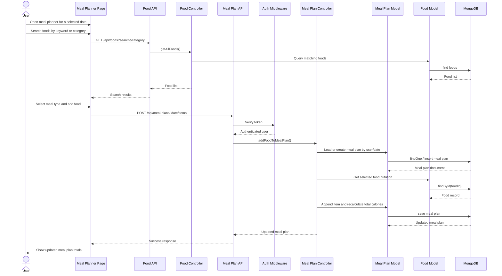
```mermaid
sequenceDiagram
    actor User
    participant MealPlanner as Meal Planner Page
    participant FoodAPI as Food API
    participant FoodController as Food Controller
    participant MealAPI as Meal Plan API
    participant AuthMW as Auth Middleware
    participant MealController as Meal Plan Controller
    participant MealPlanModel as Meal Plan Model
    participant FoodModel as Food Model
    participant DB as MongoDB

    User->>MealPlanner: Open meal planner for a selected date
    User->>MealPlanner: Search foods by keyword or category
    MealPlanner->>FoodAPI: GET /api/foods?search&category
    FoodAPI->>FoodController: getAllFoods()
    FoodController->>FoodModel: Query matching foods
    FoodModel->>DB: find foods
    DB-->>FoodModel: Food list
    FoodController-->>FoodAPI: Food list
    FoodAPI-->>MealPlanner: Search results

    User->>MealPlanner: Select meal type and add food
    MealPlanner->>MealAPI: POST /api/meal-plans/:date/items
    MealAPI->>AuthMW: Verify token
    AuthMW-->>MealAPI: Authenticated user
    MealAPI->>MealController: addFoodToMealPlan()
    MealController->>MealPlanModel: Load or create meal plan by user/date
    MealPlanModel->>DB: findOne / insert meal plan
    DB-->>MealPlanModel: Meal plan document
    MealController->>FoodModel: Get selected food nutrition
    FoodModel->>DB: findById(foodId)
    DB-->>FoodModel: Food record
    MealController->>MealPlanModel: Append item and recalculate total calories
    MealPlanModel->>DB: save meal plan
    DB-->>MealPlanModel: Updated meal plan
    MealController-->>MealAPI: Updated meal plan
    MealAPI-->>MealPlanner: Success response
    MealPlanner-->>User: Show updated meal plan totals
```

## 9. Browse and Complete Workout

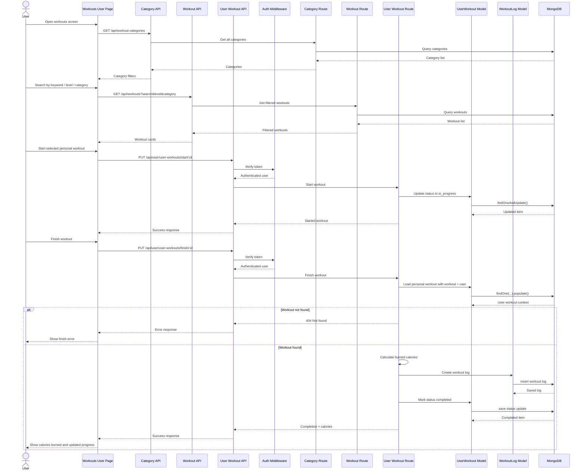
```mermaid
sequenceDiagram
    actor User
    participant WorkoutsPage as Workouts User Page
    participant CategoryAPI as Category API
    participant WorkoutAPI as Workout API
    participant UserWorkoutAPI as User Workout API
    participant AuthMW as Auth Middleware
    participant CategoryRoute as Category Route
    participant WorkoutRoute as Workout Route
    participant UserWorkoutRoute as User Workout Route
    participant UserWorkoutModel as UserWorkout Model
    participant WorkoutLogModel as WorkoutLog Model
    participant DB as MongoDB

    User->>WorkoutsPage: Open workouts screen
    WorkoutsPage->>CategoryAPI: GET /api/workout-categories
    CategoryAPI->>CategoryRoute: Get all categories
    CategoryRoute->>DB: Query categories
    DB-->>CategoryRoute: Category list
    CategoryRoute-->>CategoryAPI: Categories
    CategoryAPI-->>WorkoutsPage: Category filters

    User->>WorkoutsPage: Search by keyword / level / category
    WorkoutsPage->>WorkoutAPI: GET /api/workouts?search&level&category
    WorkoutAPI->>WorkoutRoute: Get filtered workouts
    WorkoutRoute->>DB: Query workouts
    DB-->>WorkoutRoute: Workout list
    WorkoutRoute-->>WorkoutAPI: Filtered workouts
    WorkoutAPI-->>WorkoutsPage: Workout cards

    User->>WorkoutsPage: Start selected personal workout
    WorkoutsPage->>UserWorkoutAPI: PUT /api/user/user-workouts/start/:id
    UserWorkoutAPI->>AuthMW: Verify token
    AuthMW-->>UserWorkoutAPI: Authenticated user
    UserWorkoutAPI->>UserWorkoutRoute: Start workout
    UserWorkoutRoute->>UserWorkoutModel: Update status to in_progress
    UserWorkoutModel->>DB: findOneAndUpdate()
    DB-->>UserWorkoutModel: Updated item
    UserWorkoutRoute-->>UserWorkoutAPI: Started workout
    UserWorkoutAPI-->>WorkoutsPage: Success response

    User->>WorkoutsPage: Finish workout
    WorkoutsPage->>UserWorkoutAPI: PUT /api/user/user-workouts/finish/:id
    UserWorkoutAPI->>AuthMW: Verify token
    AuthMW-->>UserWorkoutAPI: Authenticated user
    UserWorkoutAPI->>UserWorkoutRoute: Finish workout
    UserWorkoutRoute->>UserWorkoutModel: Load personal workout with workout + user
    UserWorkoutModel->>DB: findOne(...).populate()
    DB-->>UserWorkoutModel: User workout context
    alt Workout not found
        UserWorkoutRoute-->>UserWorkoutAPI: 404 Not found
        UserWorkoutAPI-->>WorkoutsPage: Error response
        WorkoutsPage-->>User: Show finish error
    else Workout found
        UserWorkoutRoute->>UserWorkoutRoute: Calculate burned calories
        UserWorkoutRoute->>WorkoutLogModel: Create workout log
        WorkoutLogModel->>DB: insert workout log
        DB-->>WorkoutLogModel: Saved log
        UserWorkoutRoute->>UserWorkoutModel: Mark status completed
        UserWorkoutModel->>DB: save status update
        DB-->>UserWorkoutModel: Completed item
        UserWorkoutRoute-->>UserWorkoutAPI: Completion + calories
        UserWorkoutAPI-->>WorkoutsPage: Success response
        WorkoutsPage-->>User: Show calories burned and updated progress
    end
```

## 10. View Progress / Overview Analytics

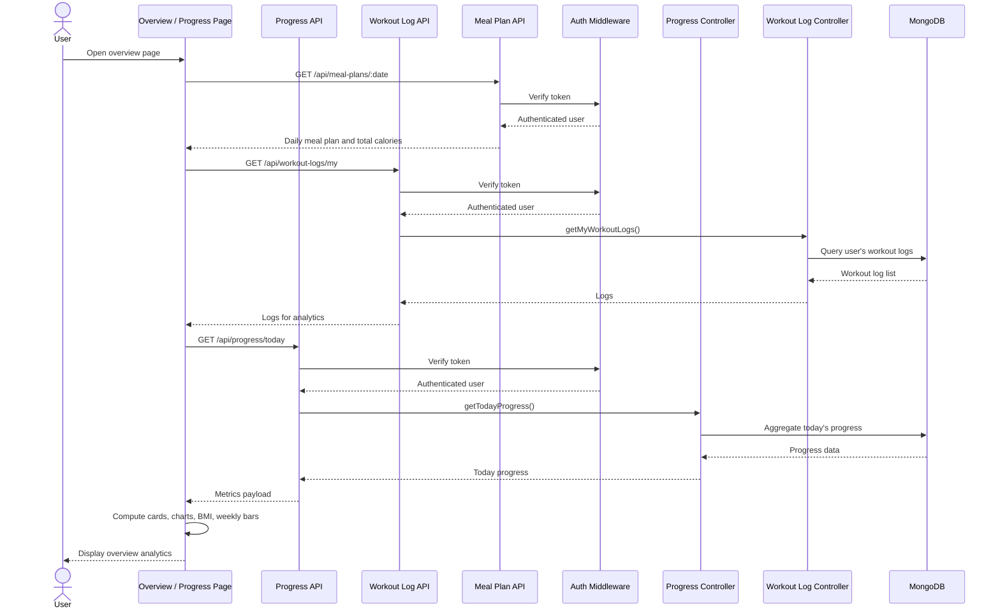
```mermaid
sequenceDiagram
    actor User
    participant OverviewPage as Overview / Progress Page
    participant ProgressAPI as Progress API
    participant WorkoutLogAPI as Workout Log API
    participant MealAPI as Meal Plan API
    participant AuthMW as Auth Middleware
    participant ProgressController as Progress Controller
    participant WorkoutLogController as Workout Log Controller
    participant DB as MongoDB

    User->>OverviewPage: Open overview page
    OverviewPage->>MealAPI: GET /api/meal-plans/:date
    MealAPI->>AuthMW: Verify token
    AuthMW-->>MealAPI: Authenticated user
    MealAPI-->>OverviewPage: Daily meal plan and total calories

    OverviewPage->>WorkoutLogAPI: GET /api/workout-logs/my
    WorkoutLogAPI->>AuthMW: Verify token
    AuthMW-->>WorkoutLogAPI: Authenticated user
    WorkoutLogAPI->>WorkoutLogController: getMyWorkoutLogs()
    WorkoutLogController->>DB: Query user's workout logs
    DB-->>WorkoutLogController: Workout log list
    WorkoutLogController-->>WorkoutLogAPI: Logs
    WorkoutLogAPI-->>OverviewPage: Logs for analytics

    OverviewPage->>ProgressAPI: GET /api/progress/today
    ProgressAPI->>AuthMW: Verify token
    AuthMW-->>ProgressAPI: Authenticated user
    ProgressAPI->>ProgressController: getTodayProgress()
    ProgressController->>DB: Aggregate today's progress
    DB-->>ProgressController: Progress data
    ProgressController-->>ProgressAPI: Today progress
    ProgressAPI-->>OverviewPage: Metrics payload

    OverviewPage->>OverviewPage: Compute cards, charts, BMI, weekly bars
    OverviewPage-->>User: Display overview analytics
```

## 11. Chat with AI Coach

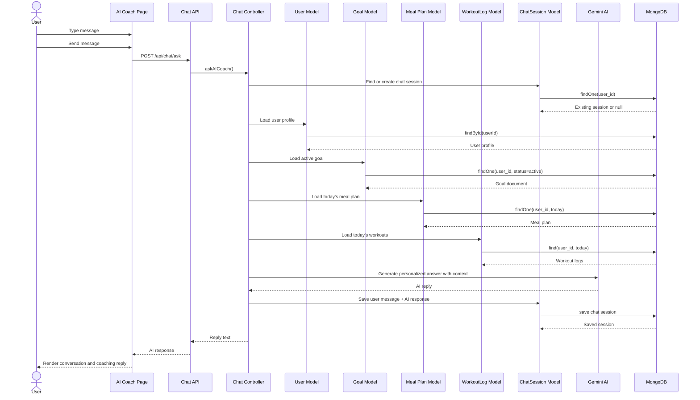
```mermaid
sequenceDiagram
    actor User
    participant AiCoachPage as AI Coach Page
    participant ChatAPI as Chat API
    participant ChatController as Chat Controller
    participant UserModel as User Model
    participant GoalModel as Goal Model
    participant MealPlanModel as Meal Plan Model
    participant WorkoutLogModel as WorkoutLog Model
    participant ChatSessionModel as ChatSession Model
    participant Gemini as Gemini AI
    participant DB as MongoDB

    User->>AiCoachPage: Type message
    User->>AiCoachPage: Send message
    AiCoachPage->>ChatAPI: POST /api/chat/ask
    ChatAPI->>ChatController: askAICoach()
    ChatController->>ChatSessionModel: Find or create chat session
    ChatSessionModel->>DB: findOne(user_id)
    DB-->>ChatSessionModel: Existing session or null
    ChatController->>UserModel: Load user profile
    UserModel->>DB: findById(userId)
    DB-->>UserModel: User profile
    ChatController->>GoalModel: Load active goal
    GoalModel->>DB: findOne(user_id, status=active)
    DB-->>GoalModel: Goal document
    ChatController->>MealPlanModel: Load today's meal plan
    MealPlanModel->>DB: findOne(user_id, today)
    DB-->>MealPlanModel: Meal plan
    ChatController->>WorkoutLogModel: Load today's workouts
    WorkoutLogModel->>DB: find(user_id, today)
    DB-->>WorkoutLogModel: Workout logs
    ChatController->>Gemini: Generate personalized answer with context
    Gemini-->>ChatController: AI reply
    ChatController->>ChatSessionModel: Save user message + AI response
    ChatSessionModel->>DB: save chat session
    DB-->>ChatSessionModel: Saved session
    ChatController-->>ChatAPI: Reply text
    ChatAPI-->>AiCoachPage: AI response
    AiCoachPage-->>User: Render conversation and coaching reply
```

## 12. Create and Interact in Community Feed

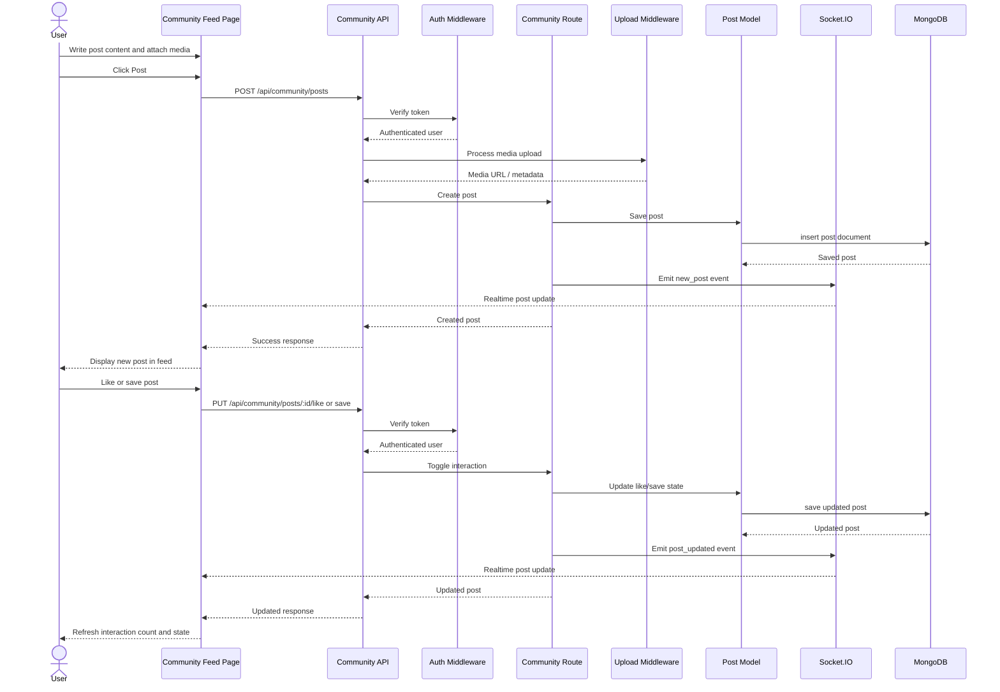
```mermaid
sequenceDiagram
    actor User
    participant CommunityFeed as Community Feed Page
    participant CommunityAPI as Community API
    participant AuthMW as Auth Middleware
    participant CommunityRoute as Community Route
    participant Upload as Upload Middleware
    participant PostModel as Post Model
    participant Socket as Socket.IO
    participant DB as MongoDB

    User->>CommunityFeed: Write post content and attach media
    User->>CommunityFeed: Click Post
    CommunityFeed->>CommunityAPI: POST /api/community/posts
    CommunityAPI->>AuthMW: Verify token
    AuthMW-->>CommunityAPI: Authenticated user
    CommunityAPI->>Upload: Process media upload
    Upload-->>CommunityAPI: Media URL / metadata
    CommunityAPI->>CommunityRoute: Create post
    CommunityRoute->>PostModel: Save post
    PostModel->>DB: insert post document
    DB-->>PostModel: Saved post
    CommunityRoute->>Socket: Emit new_post event
    Socket-->>CommunityFeed: Realtime post update
    CommunityRoute-->>CommunityAPI: Created post
    CommunityAPI-->>CommunityFeed: Success response
    CommunityFeed-->>User: Display new post in feed
    User->>CommunityFeed: Like or save post
    CommunityFeed->>CommunityAPI: PUT /api/community/posts/:id/like or save
    CommunityAPI->>AuthMW: Verify token
    AuthMW-->>CommunityAPI: Authenticated user
    CommunityAPI->>CommunityRoute: Toggle interaction
    CommunityRoute->>PostModel: Update like/save state
    PostModel->>DB: save updated post
    DB-->>PostModel: Updated post
    CommunityRoute->>Socket: Emit post_updated event
    Socket-->>CommunityFeed: Realtime post update
    CommunityRoute-->>CommunityAPI: Updated post
    CommunityAPI-->>CommunityFeed: Updated response
    CommunityFeed-->>User: Refresh interaction count and state
```

## 13. View Admin Dashboard

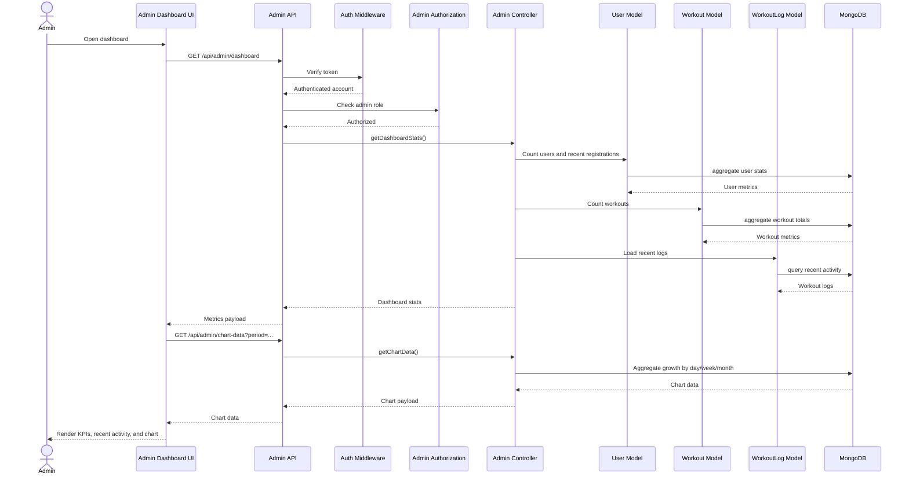
```mermaid
sequenceDiagram
    actor Admin
    participant AdminDashboard as Admin Dashboard UI
    participant AdminAPI as Admin API
    participant AuthMW as Auth Middleware
    participant AdminOnly as Admin Authorization
    participant AdminController as Admin Controller
    participant UserModel as User Model
    participant WorkoutModel as Workout Model
    participant WorkoutLogModel as WorkoutLog Model
    participant DB as MongoDB

    Admin->>AdminDashboard: Open dashboard
    AdminDashboard->>AdminAPI: GET /api/admin/dashboard
    AdminAPI->>AuthMW: Verify token
    AuthMW-->>AdminAPI: Authenticated account
    AdminAPI->>AdminOnly: Check admin role
    AdminOnly-->>AdminAPI: Authorized
    AdminAPI->>AdminController: getDashboardStats()
    AdminController->>UserModel: Count users and recent registrations
    UserModel->>DB: aggregate user stats
    DB-->>UserModel: User metrics
    AdminController->>WorkoutModel: Count workouts
    WorkoutModel->>DB: aggregate workout totals
    DB-->>WorkoutModel: Workout metrics
    AdminController->>WorkoutLogModel: Load recent logs
    WorkoutLogModel->>DB: query recent activity
    DB-->>WorkoutLogModel: Workout logs
    AdminController-->>AdminAPI: Dashboard stats
    AdminAPI-->>AdminDashboard: Metrics payload
    AdminDashboard->>AdminAPI: GET /api/admin/chart-data?period=...
    AdminAPI->>AdminController: getChartData()
    AdminController->>DB: Aggregate growth by day/week/month
    DB-->>AdminController: Chart data
    AdminController-->>AdminAPI: Chart payload
    AdminAPI-->>AdminDashboard: Chart data
    AdminDashboard-->>Admin: Render KPIs, recent activity, and chart
```

## 14. Manage Users as Admin

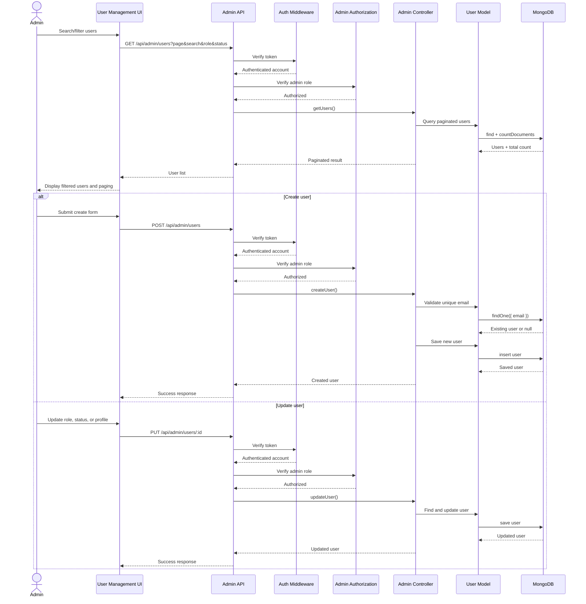
```mermaid
sequenceDiagram
    actor Admin
    participant UserMgmtUI as User Management UI
    participant AdminAPI as Admin API
    participant AuthMW as Auth Middleware
    participant AdminOnly as Admin Authorization
    participant AdminController as Admin Controller
    participant UserModel as User Model
    participant DB as MongoDB

    Admin->>UserMgmtUI: Search/filter users
    UserMgmtUI->>AdminAPI: GET /api/admin/users?page&search&role&status
    AdminAPI->>AuthMW: Verify token
    AuthMW-->>AdminAPI: Authenticated account
    AdminAPI->>AdminOnly: Verify admin role
    AdminOnly-->>AdminAPI: Authorized
    AdminAPI->>AdminController: getUsers()
    AdminController->>UserModel: Query paginated users
    UserModel->>DB: find + countDocuments
    DB-->>UserModel: Users + total count
    AdminController-->>AdminAPI: Paginated result
    AdminAPI-->>UserMgmtUI: User list
    UserMgmtUI-->>Admin: Display filtered users and paging

    alt Create user
        Admin->>UserMgmtUI: Submit create form
        UserMgmtUI->>AdminAPI: POST /api/admin/users
        AdminAPI->>AuthMW: Verify token
        AuthMW-->>AdminAPI: Authenticated account
        AdminAPI->>AdminOnly: Verify admin role
        AdminOnly-->>AdminAPI: Authorized
        AdminAPI->>AdminController: createUser()
        AdminController->>UserModel: Validate unique email
        UserModel->>DB: findOne({ email })
        DB-->>UserModel: Existing user or null
        AdminController->>UserModel: Save new user
        UserModel->>DB: insert user
        DB-->>UserModel: Saved user
        AdminController-->>AdminAPI: Created user
        AdminAPI-->>UserMgmtUI: Success response
    else Update user
        Admin->>UserMgmtUI: Update role, status, or profile
        UserMgmtUI->>AdminAPI: PUT /api/admin/users/:id
        AdminAPI->>AuthMW: Verify token
        AuthMW-->>AdminAPI: Authenticated account
        AdminAPI->>AdminOnly: Verify admin role
        AdminOnly-->>AdminAPI: Authorized
        AdminAPI->>AdminController: updateUser()
        AdminController->>UserModel: Find and update user
        UserModel->>DB: save user
        DB-->>UserModel: Updated user
        AdminController-->>AdminAPI: Updated user
        AdminAPI-->>UserMgmtUI: Success response
    end
```

## 15. Delete User as Admin

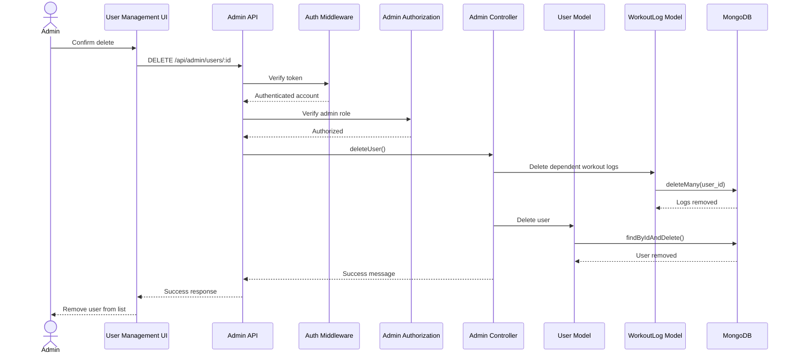
```mermaid
sequenceDiagram
    actor Admin
    participant UserMgmtUI as User Management UI
    participant AdminAPI as Admin API
    participant AuthMW as Auth Middleware
    participant AdminOnly as Admin Authorization
    participant AdminController as Admin Controller
    participant UserModel as User Model
    participant WorkoutLogModel as WorkoutLog Model
    participant DB as MongoDB

    Admin->>UserMgmtUI: Confirm delete
    UserMgmtUI->>AdminAPI: DELETE /api/admin/users/:id
    AdminAPI->>AuthMW: Verify token
    AuthMW-->>AdminAPI: Authenticated account
    AdminAPI->>AdminOnly: Verify admin role
    AdminOnly-->>AdminAPI: Authorized
    AdminAPI->>AdminController: deleteUser()
    AdminController->>WorkoutLogModel: Delete dependent workout logs
    WorkoutLogModel->>DB: deleteMany(user_id)
    DB-->>WorkoutLogModel: Logs removed
    AdminController->>UserModel: Delete user
    UserModel->>DB: findByIdAndDelete()
    DB-->>UserModel: User removed
    AdminController-->>AdminAPI: Success message
    AdminAPI-->>UserMgmtUI: Success response
    UserMgmtUI-->>Admin: Remove user from list
```

## 16. Manage Food Catalog as Admin

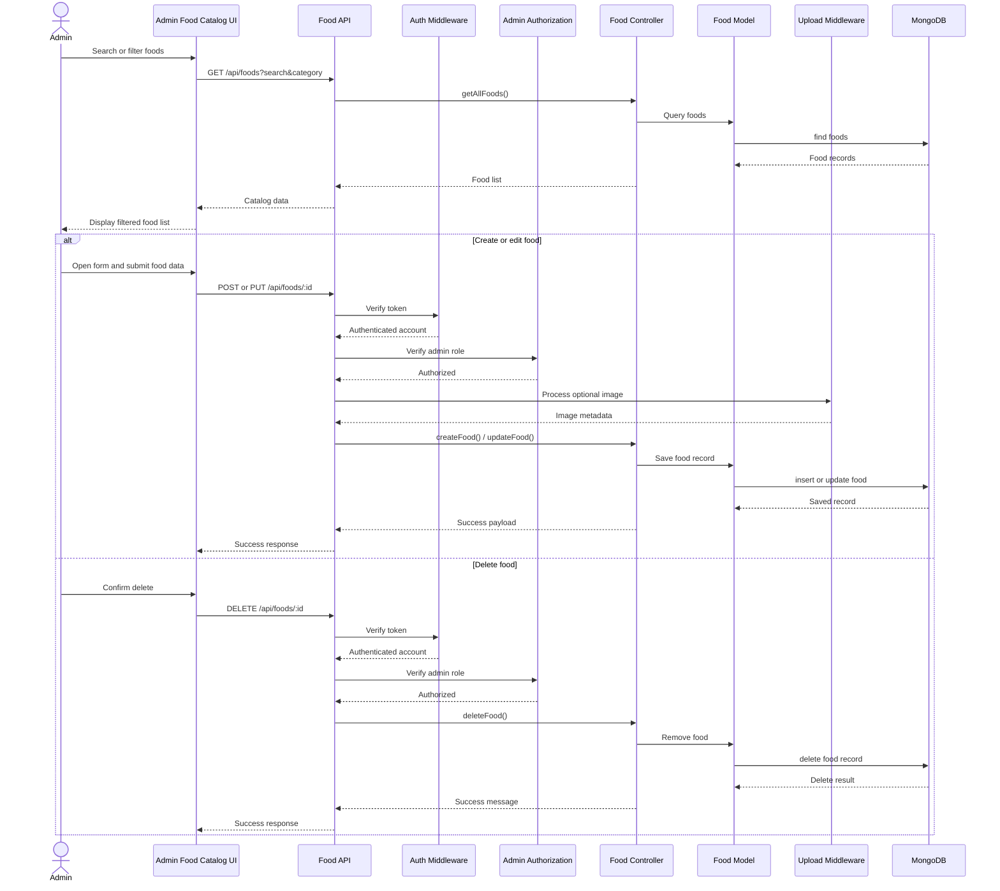
```mermaid
sequenceDiagram
    actor Admin
    participant FoodAdminUI as Admin Food Catalog UI
    participant FoodAPI as Food API
    participant AuthMW as Auth Middleware
    participant AdminOnly as Admin Authorization
    participant FoodController as Food Controller
    participant FoodModel as Food Model
    participant Upload as Upload Middleware
    participant DB as MongoDB

    Admin->>FoodAdminUI: Search or filter foods
    FoodAdminUI->>FoodAPI: GET /api/foods?search&category
    FoodAPI->>FoodController: getAllFoods()
    FoodController->>FoodModel: Query foods
    FoodModel->>DB: find foods
    DB-->>FoodModel: Food records
    FoodController-->>FoodAPI: Food list
    FoodAPI-->>FoodAdminUI: Catalog data
    FoodAdminUI-->>Admin: Display filtered food list

    alt Create or edit food
        Admin->>FoodAdminUI: Open form and submit food data
        FoodAdminUI->>FoodAPI: POST or PUT /api/foods/:id
        FoodAPI->>AuthMW: Verify token
        AuthMW-->>FoodAPI: Authenticated account
        FoodAPI->>AdminOnly: Verify admin role
        AdminOnly-->>FoodAPI: Authorized
        FoodAPI->>Upload: Process optional image
        Upload-->>FoodAPI: Image metadata
        FoodAPI->>FoodController: createFood() / updateFood()
        FoodController->>FoodModel: Save food record
        FoodModel->>DB: insert or update food
        DB-->>FoodModel: Saved record
        FoodController-->>FoodAPI: Success payload
        FoodAPI-->>FoodAdminUI: Success response
    else Delete food
        Admin->>FoodAdminUI: Confirm delete
        FoodAdminUI->>FoodAPI: DELETE /api/foods/:id
        FoodAPI->>AuthMW: Verify token
        AuthMW-->>FoodAPI: Authenticated account
        FoodAPI->>AdminOnly: Verify admin role
        AdminOnly-->>FoodAPI: Authorized
        FoodAPI->>FoodController: deleteFood()
        FoodController->>FoodModel: Remove food
        FoodModel->>DB: delete food record
        DB-->>FoodModel: Delete result
        FoodController-->>FoodAPI: Success message
        FoodAPI-->>FoodAdminUI: Success response
    end
```

## Suggested Usage

- This file now contains 16 sequence diagrams in a balanced format for the report.
- Short related flows were merged back together, while only the longest admin flow was kept partially split.
- If one specific diagram still feels crowded while you draw it, that single diagram can be split again without changing the rest of the document.
